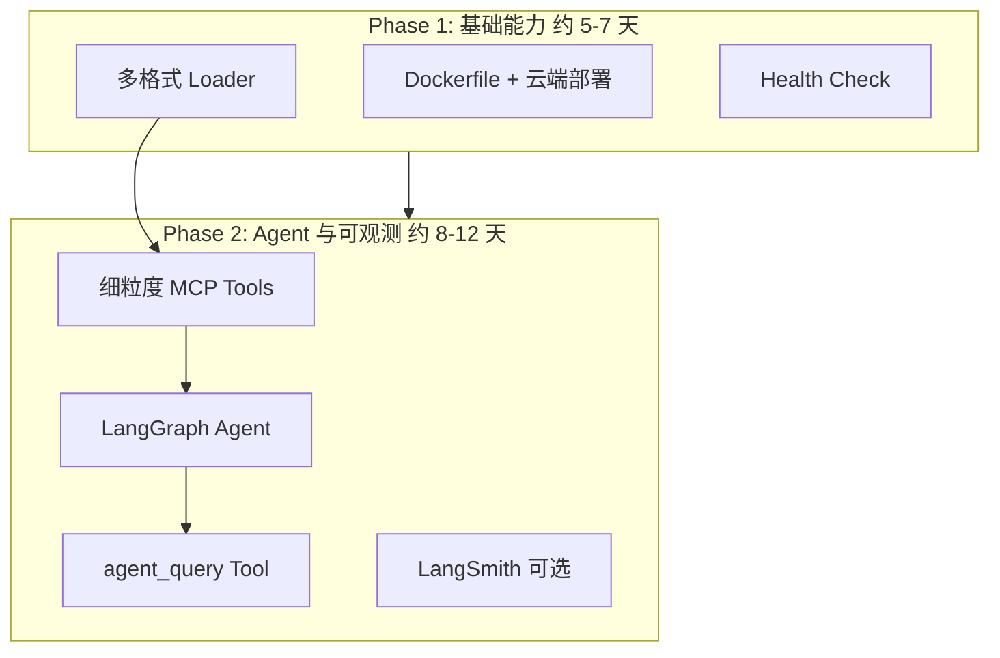
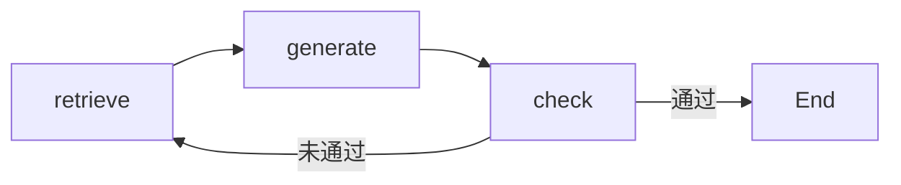

# RAG 拓展方案评估

## 一、拓展范围


| 拓展项                           | 可行性 | 风险  | 工作量   | 依赖              |
| ----------------------------- | --- | --- | ----- | --------------- |
| 多格式 Loader（Excel、JSON、MD、TXT） | 高   | 低   | 2-3 天 | 现有 BaseLoader   |
| 云端部署（Dockerfile + 云适配）        | 高   | 低   | 2-3 天 | 无               |
| Health Check                  | 高   | 低   | 0.5 天 | 无               |
| 细粒度 MCP Tools                 | 高   | 低   | 2-3 天 | 无               |
| LangGraph Agent               | 高   | 中   | 4-6 天 | 细粒度 Tools       |
| agent_query MCP Tool          | 高   | 低   | 1-2 天 | LangGraph Agent |
| LangSmith 可选集成                | 中高  | 低   | 1-2 天 | 现有 TraceContext |


---

## 二、实施计划

### 2.1 分阶段路线图




| 阶段      | 拓展项                                                 | 依赖      | 预估     |
| ------- | --------------------------------------------------- | ------- | ------ |
| Phase 1 | 多格式 Loader、Dockerfile + 云端部署、Health Check           | 无       | 5-7 天  |
| Phase 2 | 细粒度 Tools、LangGraph Agent、agent_query、LangSmith（可选） | Phase 1 | 8-12 天 |


### 2.2 Agent 实施路线


| 步骤      | 内容                       | 说明                                                                        |
| ------- | ------------------------ | ------------------------------------------------------------------------- |
| Phase 1 | 细粒度 MCP Tools            | search_by_keyword、search_by_semantic、list_document_sections、verify_answer |
| Phase 2 | 服务端 LangGraph Agent      | retrieve → generate → check → 条件再检索                                       |
| Phase 3 | agent_query MCP Tool 与配置 | 新增 Agent 入口，配置开关                                                          |
| Phase 4 | （可选）Dashboard Agent 对话页  | 可交互的 Agent 体验                                                             |


**Agent 架构**（LangGraph StateGraph）：




**新增模块**：`src/agent/`（state、tools、graph）、`agent_query` MCP Tool

### 2.3 实施后效果

- **产品形态**：从 RAG MCP 工具服务升级为 RAG + Agent 知识服务
- **能力清单**：多格式摄取、混合检索、单步 RAG、Agent 模式、细粒度 Tools、云端部署、Trace + 可选 LangSmith、Health Check
- **用户触点**：MCP 客户端（`query_knowledge_hub` / `agent_query`）、Dashboard、CLI

---

## 三、各步骤实施 Prompt

以下 Prompt 可直接复制给 AI 或用于自研执行。

### Phase 1.1 多格式loader（Excel、JSON、MD、TXT）

**预期效果**：`LoaderFactory` 支持 `.xlsx`、`.json`、`.md`、`.txt`，输出统一 `Document`，与现有 Pipeline 无缝衔接。

**实施 Prompt**：

```
在项目 src/libs/loader/ 下实现 ExcelLoader、JsonLoader、MarkdownLoader、TextLoader，
均继承 BaseLoader，输出 Document(text=..., metadata={source_path, doc_type, ...})。
- ExcelLoader：使用 openpyxl 或 pandas 读取 .xlsx，按 sheet 或按行转为 Markdown 文本。
- JsonLoader：解析 JSON，将结构化内容转为可读 Markdown（键值对或列表形式）。
- MarkdownLoader / TextLoader：直接读取文件内容，填充 Document。
在 loader_factory.py 的 LOADER_MAP 中注册 .xlsx/.json/.md/.txt。
参考 src/libs/loader/docx_loader.py 实现模式。
```

### Phase 1.2 云端部署（Dockerfile + 环境变量）

**预期效果**：`docker build` 可构建镜像，支持 Cloud Run / ECS / Container Apps 单机部署。

**实施 Prompt**：

```
为项目添加 Dockerfile：
- 基于 python:3.11-slim
- 安装项目依赖（pip install -e .）
- 工作目录 /app，COPY src/ config/ main.py 等
- CMD 运行 mcp-server 或 uvicorn/gunicorn（如 MCP 为 HTTP 模式）
- 环境变量覆盖 config/settings.yaml 中的 api_key、persist_directory 等敏感配置
在 .dockerignore 中排除 data/ logs/ .venv/ __pycache__ 等
补充 README 中「云部署」小节，说明环境变量与启动命令。
```

### Phase 1.3 Health Check

**预期效果**：MCP stdio 或 Dashboard 暴露 `/health`、`/ready`，供 K8s/云厂商探活。

**实施 Prompt**：

```
新增健康检查端点或 MCP 层探活：
- 若 MCP 为 stdio：可新增 tools/health_check，返回 {"status":"ok","components":{...}}
- 若需 HTTP：在 Dashboard 或独立 Flask/FastAPI 服务中增加 GET /health、GET /ready
检查项：ChromaDB 连接、BM25 索引可用性、配置加载成功
输出 JSON，供云厂商健康探针解析。
```

### Phase 2.1 细粒度 MCP Tools

**预期效果**：MCP 暴露 `search_by_keyword`、`search_by_semantic`、`list_document_sections`、`verify_answer`。

**实施 Prompt**：

```
在 src/mcp_server/tools/ 下新增：
1. search_by_keyword：调用 SparseRetriever（BM25），参数 query, collection, top_k
2. search_by_semantic：调用 DenseRetriever，参数 query, collection, top_k
3. list_document_sections：从 ChromaDB 或 DocumentManager 列出 collection 下的文档/分节
4. verify_answer：给定 query + answer + chunks，用 LLM 判断答案是否基于 chunks 且无幻觉
复用 src/core/query_engine/hybrid_search.py 中的 DenseRetriever/SparseRetriever，
在 protocol_handler.py 中注册新 tools。
```

### Phase 2.2 LangGraph Agent

**预期效果**：`src/agent/` 实现 StateGraph：retrieve → generate → check → 条件再检索。

**实施 Prompt**：

```
在 src/agent/ 下实现 LangGraph Agent：
1. state.py：定义 AgentState（query, chunks, answer, need_retry, ...）
2. tools.py：将 HybridSearch、Reranker、LLM 封装为 LangGraph 可调用的 Tools
3. graph.py：StateGraph 节点 retrieve -> generate -> check，条件边：need_retry 则回到 retrieve
复用 src/core/query_engine/hybrid_search.py、src/core/query_engine/reranker.py
在 pyproject.toml 添加 langgraph 依赖。
```

### Phase 2.3 agent_query MCP Tool

**预期效果**：MCP 暴露 `agent_query`，内部调用 LangGraph Agent，返回多步推理后的答案。

**实施 Prompt**：

```
在 src/mcp_server/tools/agent_query.py 实现 agent_query：
- 参数：query, collection（可选）
- 内部：创建 Agent graph，invoke(query)，取最终 answer 与 citations
- 返回：与 query_knowledge_hub 一致的 Markdown + citations 格式
在 config/settings.yaml 增加 agent 配置节（enabled, max_retries 等）
在 protocol_handler.py 注册 agent_query，根据配置决定是否启用。
```

### Phase 2.4 LangSmith 可选集成

**预期效果**：当 `LANGCHAIN_TRACING_V2=true` 且配置 `LANGCHAIN_API_KEY` 时，Trace 同时写入 LangSmith。

**实施 Prompt**：

```
在 LLM、Embedding、Reranker 调用处（或 TraceContext 输出处）增加 LangSmith 回调：
- 使用 langsmith 的 traceable 装饰器或 Client.trace_run
- 将 TraceContext 的 stages 映射为 LangSmith 的 span
- 通过环境变量控制：LANGCHAIN_TRACING_V2、LANGCHAIN_PROJECT、LANGCHAIN_API_KEY
保持与现有 JSONL Trace 并行，不替代。在 observability 配置节增加 langsmith.enabled 开关。
```

